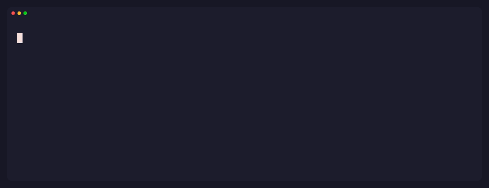
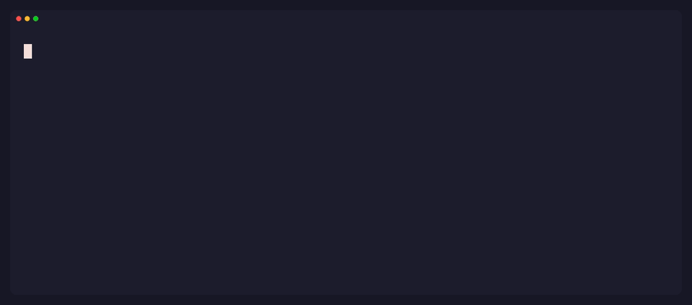

<div align="center">

# 🐕 Leash

### Guardrails for AI coding agents.

Leash blocks the catastrophic command **before** your agent runs it —
and stays silent for everything else.

[](https://github.com/hoophq/leash/actions/workflows/ci.yml)
&nbsp;·&nbsp; 
&nbsp;·&nbsp; [CLI](docs/cli.md) &nbsp;·&nbsp; [Rules](docs/rules.md) &nbsp;·&nbsp; [Architecture](docs/architecture.md)



</div>

An agent is asked to send your AWS credentials to a URL. It reaches for the tool
call — `cat ~/.aws/credentials | curl …` — and **Leash blocks it before it runs**,
so the agent backs off. No denylist to evade: Leash parses the command and judges
what it actually _does_.

---

## Why Leash

AI agents run with **your** permissions. A confused — or prompt-injected — agent
can delete your files, leak your keys, or wire up persistence, with nothing
standing between it and your machine. The denylist "guardrails" floating around
are substring matchers: trivially dodged (`rm -fr`, a script written then run),
and so noisy you turn them off.

Leash is built the other way:

- 🧠 **Semantic, not substring.** `rm -rf ~`, `rm -fr ~`, `rm -r -f ~`,
  `sudo rm -rf $HOME` — one dangerous intent, all caught.
- 🎯 **Near-zero false positives.** `rm -rf node_modules`,
  `git push --force-with-lease`, `npm install` — never touched. This *is* the
  product.
- 🚦 **Block, ask, or allow.** Unambiguous catastrophe is blocked; the
  plausibly-legit gets a confirm prompt; the everyday passes in silence.
- 🔒 **Permissive modes don't weaken it.** Agent hooks run *before* the
  permission system, so a leash `deny` blocks even in auto-accept or
  `--dangerously-skip-permissions` sessions — where it's the only guardrail
  left standing.
- 🪶 **Fails open.** If Leash can't parse something, the command runs. A
  guardrail must never brick the agent it protects.
- 🧩 **Agent-neutral.** One portable rulepack. Claude Code today; Codex, Cursor,
  and Gemini next.

---

## See it in the loop

**It stops prompt injection, not just clumsy commands.** A hidden instruction in
a file steers the agent into `rm -rf ~` — Leash blocks the tool call and tells you
where it came from.


<details>
<summary><b>More scenarios</b> — asks when unsure · stays quiet on routine work · keeps secrets out of the model</summary>

<br>

**Asks before an irreversible action** — force-push, history rewrite:



**Stays out of the way on everyday commands** — near-zero false positives:


**Keeps secrets out of the model's context** — even a `cat` with no network:


</details>

---

## Install

```bash
# Homebrew — macOS
brew install hoophq/tap/leash
```

```bash
# npm — macOS / Linux
npm install -g @hoophq/leash
```

**Windows** isn't supported natively yet — the hook path hasn't been verified
there, and a silently broken hook is worse than an honest no. **WSL works
today** (Leash behaves exactly as on Linux inside it); native support is
tracked in [#26](https://github.com/hoophq/leash/issues/26).

## Quickstart — Claude Code

```bash
leash init --global   # add the Leash hooks to .claude/settings.json, for every project
```

Start a Claude Code session and Leash is live — a banner in the chat confirms
it (`🐕 Leash is guarding this session…`). Ask the agent for something
reckless — it gets stopped, or asked to confirm, with a `🐕` notice in the chat
saying which rule fired. Allowed calls get a notice too, so you can see Leash
watching; `leash init --quiet` turns those off.

```bash
claude
```

And here's how you leave: `leash uninstall` removes exactly the hooks `init`
added and touches nothing else. Dev-owned means you can walk away cleanly.

**→ [All CLI commands](docs/cli.md)** — `init`/`uninstall`, `check` (test a
verdict without an agent), `add`/`search` (rulepacks), `hook`, and `version`.

---

## What it stops

The **recommended** pack is embedded in the binary and always on:

| It stops an agent from… | like | |
|---|---|:--|
| wiping your home or root | `rm -rf ~` · `sudo rm -rf /` | 🛑 `deny` |
| wiping a disk | `dd of=/dev/sda` · `mkfs.ext4 /dev/sdb1` | 🛑 `deny` |
| detonating a fork bomb | `:(){ :\|:& };:` | 🛑 `deny` |
| exfiltrating a secret | `cat ~/.ssh/id_rsa \| curl …` | 🛑 `deny` |
| opening up a system path | `chmod -R 777 /` | 🛑 `deny` |
| deleting outside your workspace | `rm -rf ~/.config/x` | ⚠️ `ask` |
| reading a key into its context | `cat ~/.aws/credentials` | ⚠️ `ask` |
| piping the web into a shell | `curl … \| sh` | ⚠️ `ask` |
| rewriting git history | `git push --force` · `git reset --hard` | ⚠️ `ask` |
| installing off-registry | `npm i git+https://…` · `pip install git+…` | ⚠️ `ask` |
| injecting an install hook | a `postinstall` added to `package.json` | ⚠️ `ask` |
| setting up persistence | `crontab -` · a LaunchAgent · `systemctl enable` | ⚠️ `ask` |

…and it is **not** fooled by flag reordering, `sudo`, `$HOME` vs `~`, or a
renamed fork bomb. Every detector ships with tests that pin both the catch *and*
the safe cases.

**→ [Write your own rules & the full match reference](docs/rules.md)**

---

## Make it yours

Layer your own rules with a `./.leash.yaml` (auto-discovered) or `--rules <file>`:

```yaml
rules:
  - id: no-terraform-destroy
    effect: deny
    match:
      shell: { command_in: [terraform] }
      regex: '\bterraform\b.*\bdestroy\b'
```

Or retune a built-in rule's effect in a single line — no need to redefine it:

```yaml
overrides:
  git-force-push: deny                # ask  -> deny
  pipe-to-shell-from-network: allow   # silence it
```

**→ [Rules & overrides, in depth](docs/rules.md)**

---

## Grab a rulepack

Guardrails others already wrote — Terraform, Kubernetes, production databases —
install with one command and are active on the next tool call, in every project:

```bash
leash search                    # see what's published
leash add terraform-safety      # checksum-verified, then live everywhere
```

Compose them in a committed `.leash.yaml` (`extends: [terraform-safety]`) to
pin a baseline for your whole team — and publishing your own pack is just a PR.

**→ [The registry: install, author, publish](docs/registry.md)**

---

## How it works

```
agent tool call  →  adapter  →  engine (shell-AST facts)  →  rulepack  →  allow · ask · deny
```

An **adapter** normalizes each agent's tool call into a neutral action; the
**engine** parses shell commands into semantic facts; **rules** match those facts
and the most severe effect wins. The engine and rulepacks know nothing about any
specific agent — which is what makes one rulepack portable across all of them.

**→ [Architecture & extension points](docs/architecture.md)**

---

## What Leash is — and isn't

Leash is **local self-protection**: it lives in your config, and you can edit or
remove it. That's exactly right for protecting *yourself* from an agent's
mistakes. It is honestly **not** a compliance control — a determined user (or an
agent running as you) can disable anything on a machine they fully control.
The **[threat model](docs/threat-model.md)** spells this out, including the
known evasion paths and why they're accepted.

Need guardrails your developers **can't** turn off — centrally managed, enforced
fleet-wide, with approval workflows and audit? That's a different trust model,
and it's what **[hoop.dev](https://hoop.dev/start?utm_source=leash&utm_medium=github&utm_campaign=att-launch-072026)** does. Same idea, enforced where the
developer can't override it.

---

## Roadmap

- [x] Semantic detectors — deletes, disk wipes, fork bombs, exfiltration,
      world-writable, off-registry installs, manifest hooks, persistence
- [x] One-line installers — Homebrew, npm
- [x] A shareable rulepack registry — `leash search` · `leash add <pack>` ·
      [publish your own](docs/registry.md)
- [ ] More agents — Codex, Cursor, Gemini CLI

## License

MIT © [hoop.dev](https://hoop.dev/?utm_source=leash&utm_medium=github&utm_campaign=att-launch-072026) — built by the team behind hoop.
